# README

# 예측 기반 건물 에너지 최적화: 패턴 분석과 이상 탐지를 통한 비용 절감

ASHRAE Energy Prediction 데이터셋을 활용하여 건물별 전력 사용 패턴을 분석하고, 시계열 기반 예측 모델과 이상 탐지 로직을 결합해 에너지 효율 개선 인사이트를 도출한 프로젝트이다.

---

## 목차

1. [프로젝트 개요](about:blank#%ED%94%84%EB%A1%9C%EC%A0%9D%ED%8A%B8-%EA%B0%9C%EC%9A%94)
2. [문제 정의](about:blank#%EB%AC%B8%EC%A0%9C-%EC%A0%95%EC%9D%98)
3. [데이터 이해](about:blank#%EB%8D%B0%EC%9D%B4%ED%84%B0-%EC%9D%B4%ED%95%B4)
4. [데이터 전처리](about:blank#%EB%8D%B0%EC%9D%B4%ED%84%B0-%EC%A0%84%EC%B2%98%EB%A6%AC)
5. [EDA](about:blank#eda)
6. [Feature Engineering](about:blank#feature-engineering)
7. [모델링](about:blank#%EB%AA%A8%EB%8D%B8%EB%A7%81)
8. [평가](about:blank#%ED%8F%89%EA%B0%80)
9. [인사이트](about:blank#%EC%9D%B8%EC%82%AC%EC%9D%B4%ED%8A%B8)
10. [비즈니스 제안](about:blank#%EB%B9%84%EC%A6%88%EB%8B%88%EC%8A%A4-%EC%A0%9C%EC%95%88)
11. [최적화 프로토타입](1)
12. [한계 및 향후 개선](about:blank#%ED%95%9C%EA%B3%84-%EB%B0%8F-%ED%96%A5%ED%9B%84-%EA%B0%9C%EC%84%A0)

---

## 1. 프로젝트 개요

ASHRAE 데이터를 활용하여 건물 에너지 수요를 예측하고, 이상 탐지 및 최적화를 통해 비용 절감 전략을 제시한 프로젝트

**분석 전체 구조**

```python
1. 문제 정의
2. 데이터 이해
3. EDA
4. 전처리
5. Feature Engineering
6. 모델링
7. 평가
8. 인사이트
9. 비즈니스 제안 
10. 최적화 프로토타입
```

**핵심 성과**

```markdown
## 🔑 Key Results

- RMSLE 0.41 (LightGBM)
- Peak 전력 최대 22% 감소 (Building 802)
- 비용 최대 15.9% 절감 (LP 최적화)
- 이상 소비 구간 탐지
```

---

## 2. 문제 정의

건물 에너지 비용이 지속적으로 증가하면서, 운영 효율을 높이고 불필요한 에너지 낭비를 줄이는 것이 중요한 과제가 되었다. 특히 다음과 같은 문제가 존재한다.

**현실 배경**

- 에너지 사용량을 사전에 예측하지 못해 피크 시간 대응이 어려움
- 설비 이상 또는 누수로 인한 비정상 소비 발생
- 건물별 사용 패턴이 달라 일괄적인 관리가 비효율적

> ⇒  건물별 전력 및 열에너지 사용 데이터를 활용하여
> 
> 
> **수요 예측과 비정상 소비 탐지를 수행하고,
> 피크 부하 관리 및 설비 이상 대응을 통한 에너지 운영 최적화 방안 제시**
> 

---

## 3. 데이터 이해

- ASHRAE Energy Dataset 사용
- 시계열 기반의 다건물 구조 데이터
- 건물별 에너지 사용량 (전기, 냉수, 증기, 온수)
    - train.csv / test.csv
    
    | 변수명 | 설명 |
    | --- | --- |
    | `building_id` | 건물 식별자 |
    | `meter` | 에너지 유형 (`0: 전기`, `1: 냉수`, `2: 증기`, `3: 온수`) |
    | `timestamp` | 측정 시각 (시간 단위) |
    | `meter_reading` | 에너지 소비량 (kWh 또는 변환값) |
- 기상 데이터 및 건물 메타데이터 포함
    - building_meta.csv
    
    | 변수명 | 설명 |
    | --- | --- |
    | `building_id` | 건물 식별자 |
    | `site_id` | 지역 식별자 (기상 데이터와 연결) |
    | `primary_use` | 건물 용도 (예: 교육, 사무, 병원 등) |
    | `square_feet` | 건물 면적 |
    | `year_built` | 건축 연도 |
    | `floor_count` | 층 수 |
- 기상 데이터
    - weather_train.csv / weather_test.csv
    
    | 변수명 | 설명 |
    | --- | --- |
    | `site_id` | 지역 식별자 |
    | `air_temperature` | 기온 (°C) |
    | `cloud_coverage` | 구름량 |
    | `dew_temperature` | 이슬점 온도 |
    | `precip_depth_1_hr` | 강수량 |
    | `sea_level_pressure` | 해수면 기압 |
    | `wind_direction` | 풍향 |
    | `wind_speed` | 풍속 |

**특징**

데이터는 계절성, 시간대별 패턴, 건물 특성에 따라 에너지 사용량이 크게 달라지는 특징을 가지고 있다

**데이터 구조 관계**

```python
building_meta (건물 정보)
			  ↓ (building_id)
train/test (에너지 사용량)
				↓ (site_id)
weather (기상 데이터)
```

---

## 4. 데이터 전처리

1. **기본 전처리**
    - Missing value 처리
    - 이상치 제거 (1차 필터링)
    - Timestamp 변환
    - building_id 기준 정리
    - 건물별 데이터 분리, meter type별 분류
    - 시간 단위 feature 생성 (hour, day, month)
    
2. **Weather 데이터 결측치 처리 전략**
    
    
    | 컬럼 | 방법 |
    | --- | --- |
    | air_temperature | 시간 보간 (interpolation) |
    | dew_temperature | 시간 보간 |
    | wind_speed | 보간 or 0 |
    | cloud_coverage | 그룹 median |
    | precipitation_depth_1_hr | 0 (비 안 온 걸로 처리) |
    | sea_level_pressure | 보간 |
3. **결측치 비율 및 해석**
    
    
    | 컬럼 | 결측 비율 | 해석 |
    | --- | --- | --- |
    | floor_count | 82.65% | feature보다 flag 처리가 적합 |
    | year_built | 59.99% | building_age도 결측 많음 → 중앙값 대체 |
    | cloud_coverage | 43.66% | site_id별 보간 후 남는 결측은 전체 중앙값 2차 대체 |
    | precip_depth_1_hr | 18.54% | 강수 없음=0 가정 유지 |
    | wind_direction | 7.17% | 보간으로 충분 |
    | sea_level_pressure | 6.09% | 보간으로 충분 |
    | wind_speed / dew_temperature / air_temperature | 1% 미만 | 거의 완전한 데이터 |
    | time_diff | 0.45% | groupby 첫 행은 0 또는 median으로 채움 |
    - 처리 후 `sea_level_pressure`가 781,776개 남았는데, 이는 특정 site 전체 기간이 통째로 결측된 경우로 확인되어 **전체 중앙값으로 2차 대체**하여 결측치 0개로 마무리했다.

1. **이상치 분석 및 처리 (핵심 발견)**
    
    1. 데이터 품질 이슈 발견
    
    - **건물 1099 (steam meter, meter=2)**
        - Top 20 이상치가 전부 `building_id=1099`, `meter=2(steam)`, `site=13`, `Education`에 집중
        - 최댓값 21,904,700 — 2위 건물(778) 대비 약 25배 차이
        - 1~6월 내내 10^7 스케일에서 요동 → 6개월간 지속되는 비정상 패턴
        - 7~10월은 완전히 0 (센서 고장/미터 교체로 추정)
        - 11월에 다시 짧게 2.0e7까지 튀었다가 0으로 복귀
        
        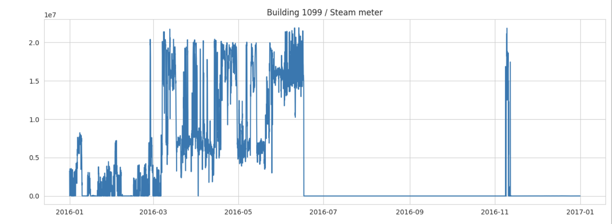
        
        결론 :  데이터 오류(단위 변환 오류/센서 이상)로 판단 → building 1099의 steam meter 제외
        
    - **건물 778 (electric meter, meter=1)**
        - 9~10월 구간만 딱 800,000 근처로 튀었다가 그 앞뒤로는 계속 0
        - 특정 기간 동안 스케일이 다르게 찍힘 → 구간 전체 단위 오류로 판단
            
            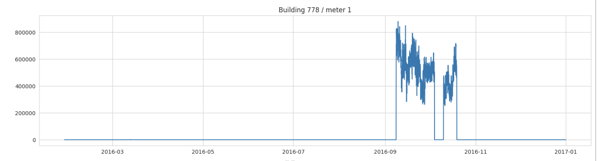
            
        
        결론 : building 778의 electric meter 제외
        
    - **건물 1088 (steam meter, meter=2)**
        - 겨울(1월, 11~12월)에 높고 여름(7~9월)에 낮은 **뚜렷한 계절성** → steam(난방)의 전형적 패턴
        - 스케일도 0~4만 수준으로 다른 정상 건물들과 비슷한 범위
        - 값이 튀는 게 아니라 **일별로 자연스럽게 오르내리는 변동성**(아마 난방을 켰다 껐다 하는 실제 사용 패턴)
        
        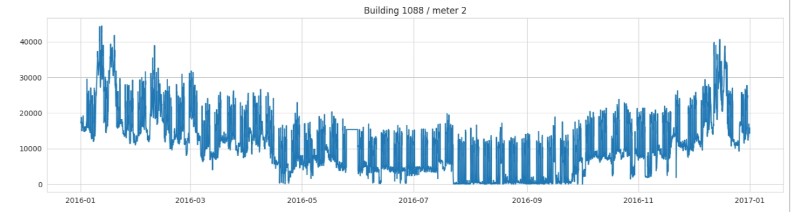
        
        결론 : 정상적인 계절 신호이므로 그대로 유지
        
    - **건물 993 (meter=2)**
        - 평소엔 0~2000 근처, 특정 시점(1~2월 두 번, 3/5/7/10/12월)에만 순간적으로 스파이크
        - 지속 구간이 아닌 찰나의 스파이크 → 클리핑(clipping)이 적합한 케이스
        
        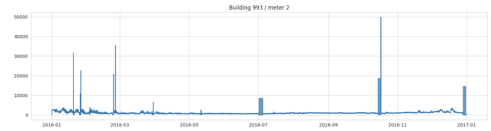
        
        결론: 베이스라인은 유지하고 튀는 점만 클리핑
        
    - **Meter_reading = 0 값 비율 (IQR 기준)**
        - meter별 10~13% 수준으로 고르게 분포
        - meter=3(온수) 27% → 여름철 난방 미사용으로 자연스러움
        - meter=0(전기) 4.4% → 상시 사용 특성상 합리적
        
        결론: 계절성/사용 패턴을 반영한 정상 결과
        
    
    2. 에너지 사용 패턴 분석 - Correlation Heatmap 해석
    
    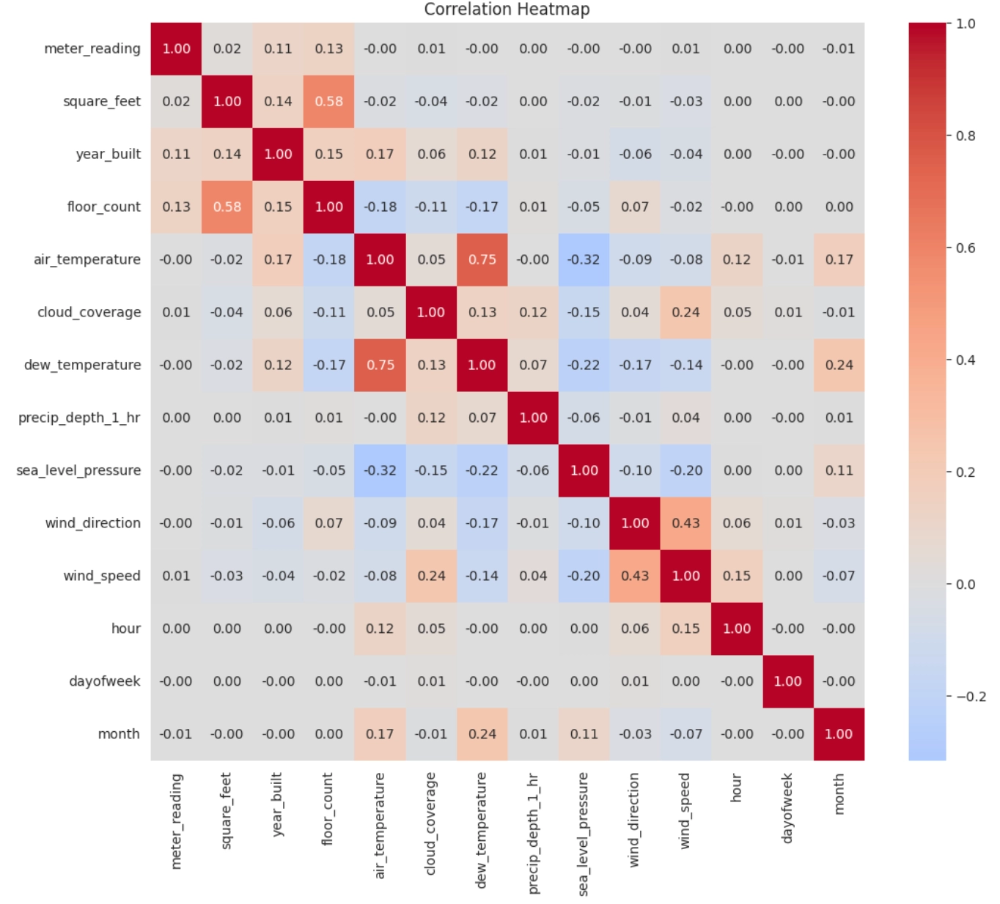
    
    | 기준 | 발견 |
    | --- | --- |
    | 원본 meter_reading | 극단값 하나가 전체 상관계수를 왜곡 |
    | log1p 변환 후 | `square_feet` 0.37, `floor_count` 0.34, `year_built` 0.10 → 건물이 클수록/층수가 많을수록 사용량 증가 관계가 명확해짐 |
    | 기상 변수 | 전체 meter 통합 시 -0.03~0.03으로 약함 → 냉방(온도↑ 소비↑)과 난방(온도↑ 소비↓)이 상쇄되기 때문 |
    
    > ⇒ **log 변환 필수**, 기상-소비 관계는 meter별로 나눠 재계산 필요
    > 
    
    - **Meter별 air_temperature 상관계수 (log 변환 후)**
        - meter=0 (전기): -0.004 (거의 무관)
        - meter=1 (냉수): +0.436 (온도↑ → 소비↑, 냉방)
        - meter=3 (온수): -0.419 (온도↑ → 소비↓, 난방)
        - meter=2 (증기): -0.410 (온도↑ → 소비↓, 난방)

1. **Target 변환**

```
y = log1p(meter_reading)
```

⇒ RMSLE 최적화를 위한 로그 변환 적용

---

## 5. EDA

**1. Target 분석**

- meter_reading 로그 변환 분포 확인
- log 변환 필요성 재확인

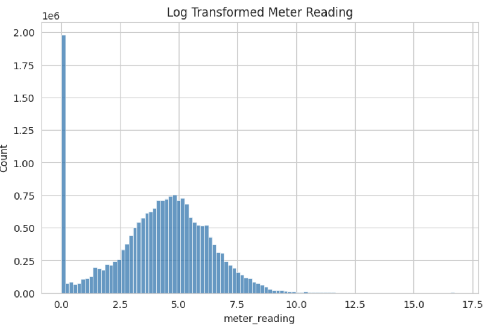

**2. 시간대별 소비 패턴**

- **시간대**: 낮(15시경 피크) vs 새벽(5~6시 저점)

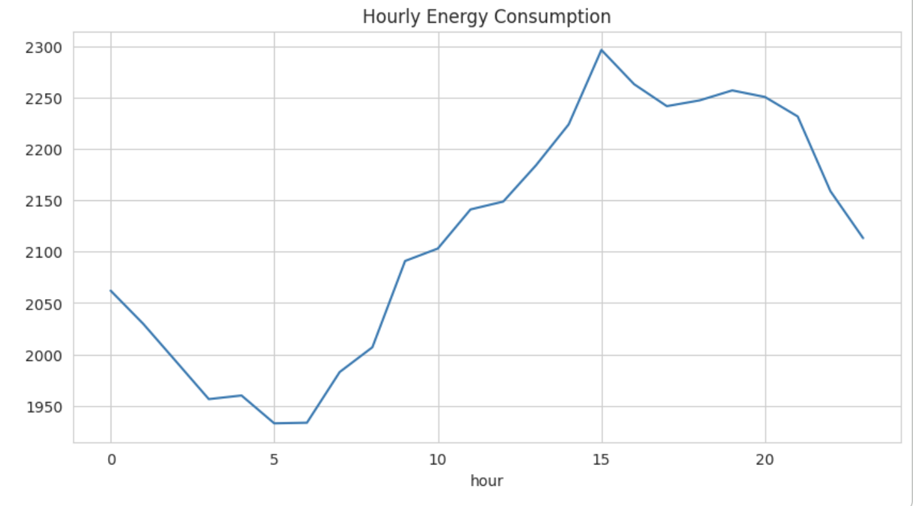

- **요일**: 화요일(2) 최대, 주말(5,6) 감소

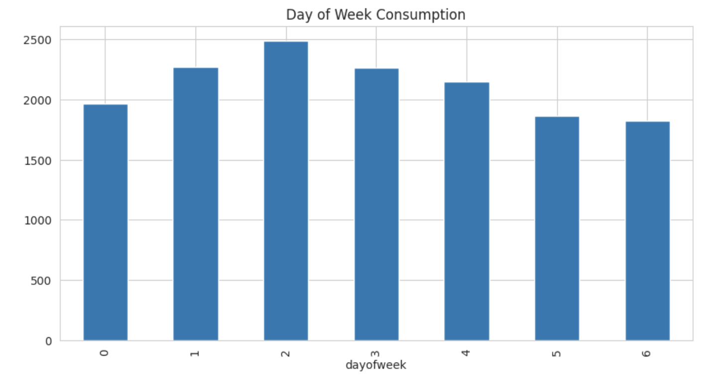

- **월별**: 3~6월 및 겨울철 소비 높음 (난방 영향)
    
    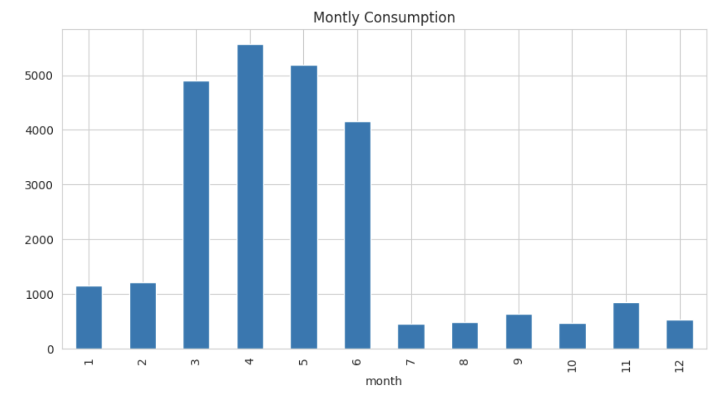
    

**3. 건물별 소비량 비교**

- 고소비 vs 저소비 건물, building size별 소비 차이
- Site별 소비
    - site 13이 압도적으로 높음 (14,000 수준, 나머지는 대부분 2,000 미만)

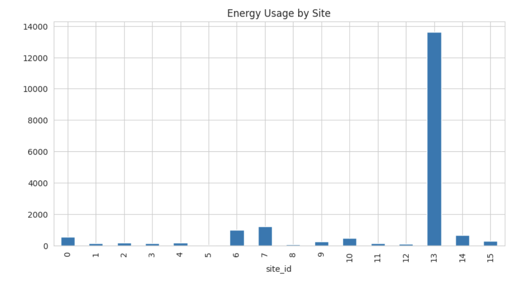

**4. 계절성 분석**

- 여름/겨울 피크 비교, Humidity·Temperature·Site별 영향

**5. Meter별 분석**

- **전기**: 낮 시간대(11~16시) 소비 피크, 완만한 일변동

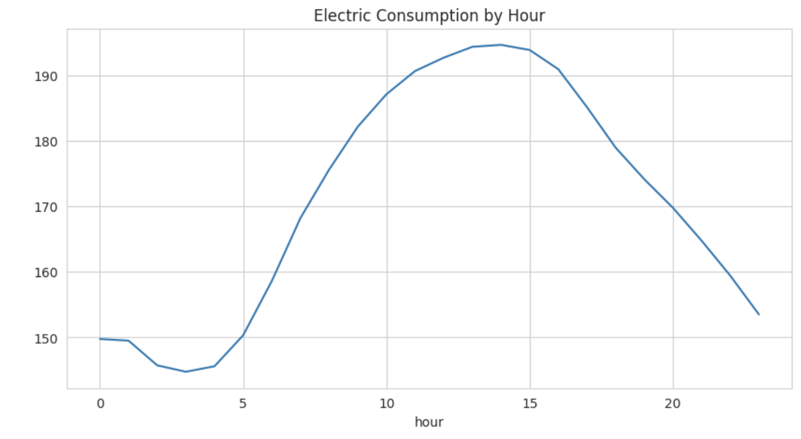

- **냉방(Chilled Water)**: 9월에 최고치(여름 냉방 수요)
    
    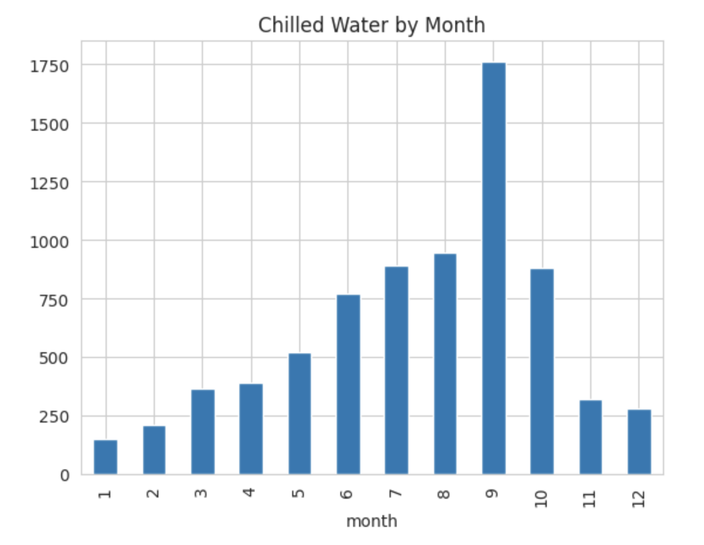
    
- **증기(Steam)**: 3~6월 높고 7~9월 낮음 (겨울/환절기 난방)
    
    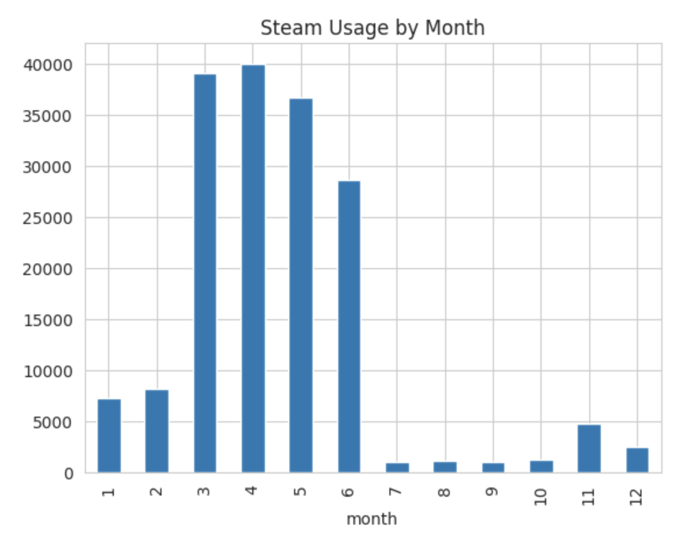
    
- **온수(Hot Water)**: 겨울(1,2,11,12월) 높고 여름(5,6월) 낮음, 뚜렷한 on/off성 패턴
    
    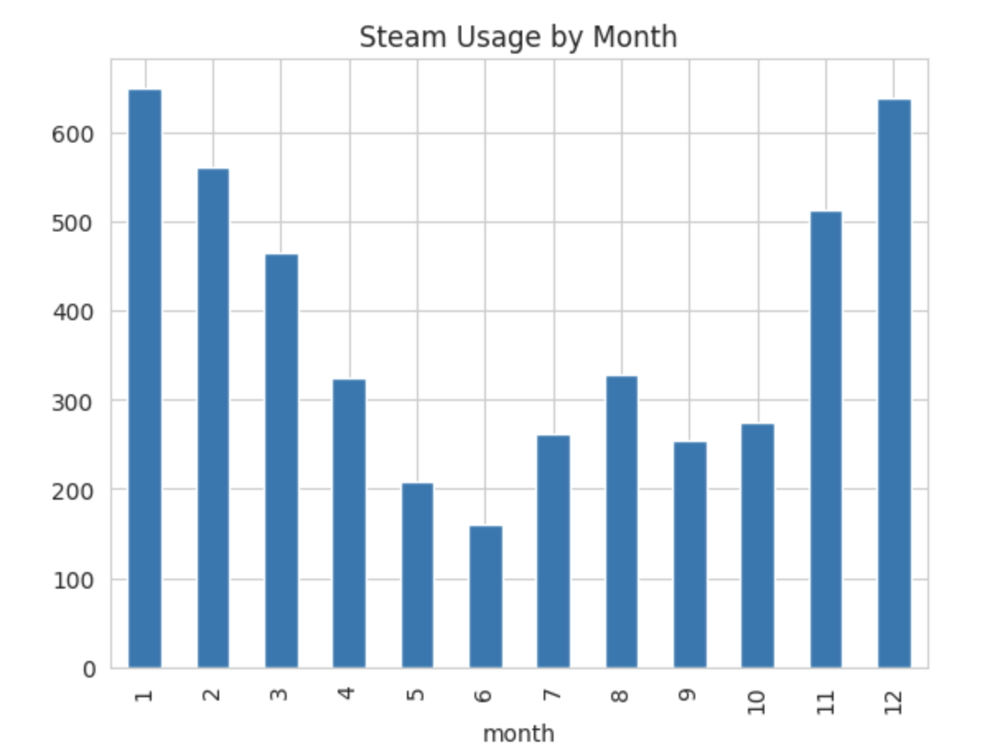
    

> 예시 인사이트: “특정 건물은 야간에도 높은 전력 소비를 보여 비정상적인 패턴 가능성이 있음”
> 

---

## 6. Feature Engineering

```
[기본]
- building_id, site_id, meter

[시간]
- hour, dayofweek, month, weekend
- sin/cos 인코딩 (hour, month)

[건물]
- square_feet (log), building stats
- primary_use, year_built

[날씨]
- temp, dew, wind
- CDD, HDD (냉방도일/난방도일)

[시계열]
- lag (1, 24, 168)
- rolling (mean, std) — 24시간 기준

[기타]
- interaction (temp x humidity, temp x building type)
```

**생성된 주요 피처**

1. 시간 feature
    - hour
    - Day
    - Weekday
    - Month
    - Is_weekend
2. Cyclical encoding
    - hour → sin/cos
    - Month → sin/cos
3. Lag feature
    - lag_1
    - Lag_24
    - Lag_168
4. Rolling statistics
    - rolling mean (24h)
    - Rolling std
5. Building feature
    - square_feet
    - Primary_use
    - Year_built
6. Weather interaction
    - temp x humidity
    - Temp x building type

---

## 7. 모델링

1. **모델 선택**
    
    
    | 구성 | 내용 |
    | --- | --- |
    | Baseline | Linear Regression |
    | Main model | LightGBM |
    | Validation | Time-based split (train: 과거, valid: 미래) |
    | Optional | RandomForest, XGBoost,Ensemble |
2. **모델 선택 근거**
    
    
    | 데이터 특성 | LightGBM의 대응 | 대안 모델이었다면 |
    | --- | --- | --- |
    | 2천만 행 초대용량 | Histogram 기반 분할 + leaf-wise 성장 | RandomForest는 메모리 폭증 가능성 |
    | 카디널리티 다른 categorical | 원-핫 없이 자체 최적 분기 | 선형모델/RandomForest는 building_id 1,400개 컬럼 폭발 |
    | 구조적 결측치 | NaN 자체 분기 처리 | 선형모델은 명시적 대체 필요, 정보 손실 |
    | Non-linear/조건부 관계 | 비선형 상호작용 자동 포착 | 선형모델은 이런 관계를 원천적으로 놓침 |
    | 강한 시계열 자기상관 | lag/rolling feature를 자동 식별 | feature engineering 역할이 더 큼 |
3. **모델 비교 결과 (10% 샘플링)**
    - LightGBM이 성능과 학습 속도 양쪽에서 가장 우수하다.
    - Linear Regression은 meter별 온도-소비 관계가 상반되게 나타나는 등의 비선형적 구조를 선형모델이 표현하지 못한 한계가 보인다.
    - RandomForest는 2천만 행 규모의 데이터에서는 실용적이지 못할 것으로 보여진다.
    
    | Model | RMSLE | 학습시간 | 상대속도 |
    | --- | --- | --- | --- |
    | Linear Regression | 0.4693 | 13.1초 | 가장 빠름 |
    | RandomForest | 0.4422 | 782.7초 (약 13분) | 가장 느림 |
    | **LightGBM** | **0.4227** | 34.3초 | 중간 |

```markdown
## Modeling

RandomForest와 LightGBM을 비교하여 모델을 선정하였다.

- RandomForest는 Bagging 기반 모델로 분산 감소에 강점이 있음
- LightGBM은 Gradient Boosting 기반으로, 이전 오차를 보완하며 학습하여 예측 성능에 유리함

실험 결과, LightGBM이 더 낮은 RMSLE를 기록하였으며  
특히 시계열 기반 feature (lag, rolling)를 효과적으로 학습하는 모습을 보였다.

=> 따라서 최종 모델로 LightGBM을 선택하였다.

* Tree 기반 Boosting 모델은 비선형 관계 및 변수 간 상호작용을 잘 반영하기 때문에
건물별 다양한 에너지 소비 패턴을 모델링하는 데 적합하다고 판단하였다.

* 추가적으로 XGBoost 등 다른 Boosting 계열 모델도 고려 가능하나,
LightGBM이 학습 속도 및 성능 측면에서 충분히 우수하다고 판단하였다.
```

1. **학습 결과**
- Train/Valid 분리
    - split date `2016-11-01`
    - 데이터 크기: train (16,786,316, 34), valid (3,412,915, 34)
- **Best iteration [2000]**: train rmse 0.3824, valid rmse 0.4121

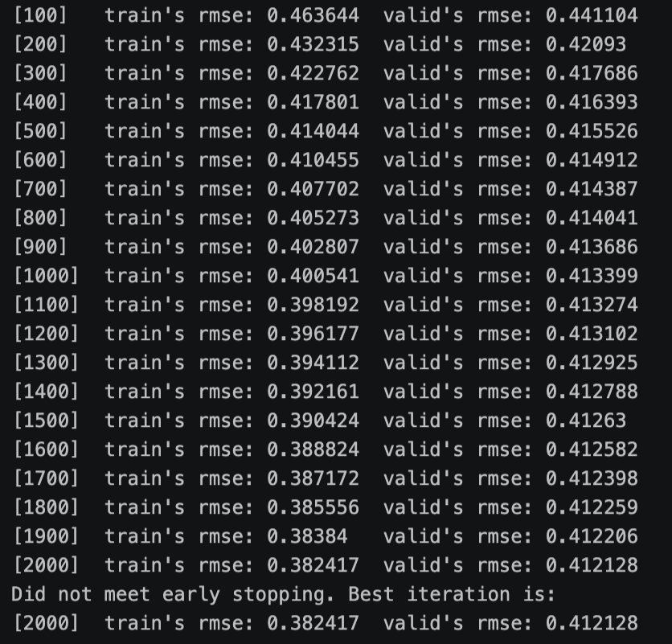

- **Feature Importance**
    - `lag_1`의 의존도가 압도적으로 높고, `rolling_mean_24`, `lag_24`가 뒤를 이음
    
    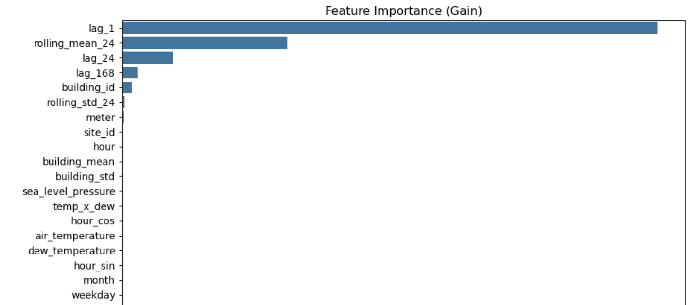
    

1. Lag 제거 실험 (강건성 검증)
    - lag 제거 분석이 필요한 이유
        - 데이터의 관성 때문에 얻은 성능
        - **새로 지어진 건물**: 과거 이력이 아예 없으면 lag를 쓸 수 없음
        - **장기 예측**(예: 한 달 뒤 예측): 그 시점 직전 값을 알 수 없음
        - **센서 고장/데이터 유실 구간**: lag 자체가 결측
    
    **질문**: lag_1이 압도적으로 중요하다면, lag가 없는 상황(신규 건물, 장기 예측, 센서 고장 구간)에서는 모델이 무엇을 근거로 예측하는가?
    
    **실험**: lag/rolling feature를 전부 제거하고 재학습
    
    - 결과 해석
        - RMSLE가 0.412 → 1.028로, 거의 2.5배 나빠짐
        - 149.9% 악화, 성능 붕괴
    
    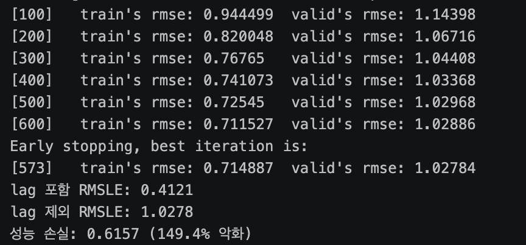
    
    | 조건 | RMSLE |
    | --- | --- |
    | lag 포함 | 0.4121 |
    | lag 제외 | 1.0278 |
    | 성능 손실 | 0.6157 (149.4% 악화) |
    - **Feature Importance 순위 변화**
        - lag 제거 시 `building_mean`(장기 평균)이 1위로 부상
        - 건물 크기(`square_feet`), 계절(`month`), 날씨(`HDD`) feature가 뒤이어 중요도 상승
    
    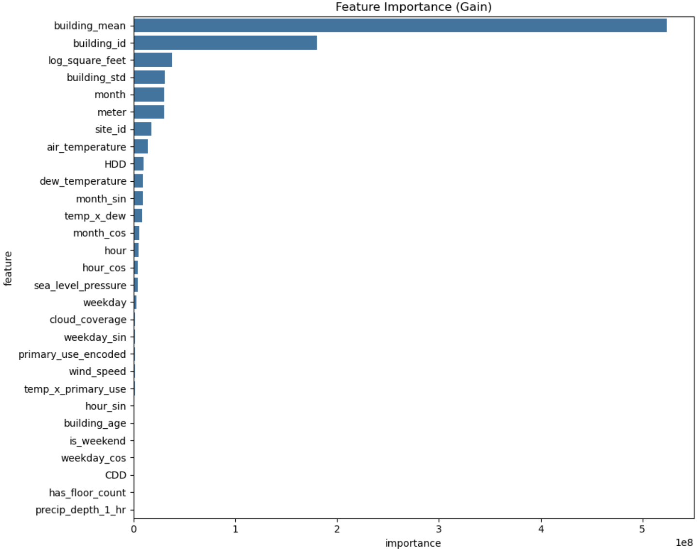
    

```python
발견 1: lag_1 제거 시 RMSLE가 149% 악화됨
  → 이 모델의 정확도는 상당 부분 "직전 소비 패턴을 안다"는 
     전제에 기대고 있었다

발견 2: lag 없이도 모델이 완전히 무너지진 않음 (RMSLE 1.03, 
        여전히 예측 자체는 가능한 수준)
  → building_mean, square_feet, month, HDD 같은 
     "구조적/계절적 정보"가 대체 근거로 작동

결론: 이 모델은 두 층위의 정보에 의존한다
  1) 단기 관성(직전 1시간 소비) — 있으면 압도적으로 정확
  2) 구조적 특성(건물 평균 소비 수준, 계절, 크기) — 
     없어도 예측은 가능하지만 정확도는 크게 떨어짐

실무 함의: 
  - 기존 건물 + 짧은 시간 예측 → 현재 모델 그대로 매우 유효
  - 신규 건물(이력 없음) 또는 장기 예측 → 
    building_mean 계산 자체가 불가능하므로 추가 보완 필요 
    (예: 유사 건물 클러스터링으로 대체 평균 사용)
```

1. Meter별 심화 분석
    - RMSLE 결과 예측 난이도
        - 전기와 온수의 차이가 6배 이상이다.
        - meter마다 예측 난이도가 완전히 다르다
    
    | meter | RMSLE | 난이도 |
    | --- | --- | --- |
    | electricity | 0.1505 | 가장 쉬움 |
    | chilledwater | 0.4699 | 중간 |
    | steam | 0.6164 | 어려움 |
    | hotwater | 0.9590 | 가장 어려움 |
- 종합 RMSLE 비교
    
    ```python
    meter별 모델 종합: 0.4101
    통합 모델:        0.4128
    ```
    
    - Meter별 모델 종합 RMSLE: **0.4101** (통합 모델 0.4128 대비 0.0027 개선 — 방향은 맞으나 개선 폭은 제한적)
    - **electricity가 쉬운 이유**: 0값 비율이 4.4%로 가장 낮고 사용 패턴이 안정적 → lag_1만으로도 예측 정확도 높음
    - **hotwater가 어려운 이유**: 0값 비율 27%로 가장 높고, 계절에 따라 켰다 껐다 하는 on/off성 패턴 → 예측 난도 상승
    - **공통점**: electricity, chilledwater 모두 lag_1이 압도적 1위, rolling_mean_24가 2위 → 단기 관성 의존은 meter 공통 패턴
    - **차이점**: hotwater는 상위 feature에 air_temperature가 추가로 등장 → 온수는 날씨(기온) 의존도가 상대적으로 더 드러남

---

## 8. 평가

**Metric**: RMSLE = `sqrt(mean((log(y+1)-log(y_pred+1))^2))`

**Validation RMSLE: 0.41213**

1. 핵심 체크
    
    
    | 항목 | 결과 |
    | --- | --- |
    | Overfitting 여부 | Train/Valid RMSE 격차 7.8% → 과적합 우려 낮음 |
    | Building bias | 오차 방향(과대/과소)이 건물마다 제각각, 시스템적 편향 없음 |
    | Site bias | site 14가 다른 site 대비 2~5배 높은 오차(MAE 0.327). site 13(고소비)은 오차는 중간 수준 → “소비량 크기”와 “예측 난이도”는 비례하지 않음. site 단위 평균 오차 방향성 편향은 미미(±0.01 이내) |
2. Validation Strategy
    - Time split vs Random split
    
    ```python
    Time split RMSLE: 0.4121
    Random split RMSLE: 0.4138 (차이 0.4%, 사실상 유의미하지 않음)
    
    ⇒ 이번 실험에서는 random split이 time split보다 나은 성능을 
      보이지 않았다. 다만 이는 building_mean/std feature가 
      time split 기준으로 미리 계산되어 두 실험에 동일하게 
      적용된 영향일 수 있어, "random split의 leakage 이점"이 
      완전히 배제된 상태의 비교였다.
    
    ⇒ 그럼에도 Time split을 최종 채택한 이유는 성능 비교 때문이 
      아니라, lag_1/rolling 같은 시계열 feature가 근본적으로 
      "미래 시점이 과거를 설명하는" 구조적 leakage 위험을 
      갖고 있고, 실제 서비스 환경(항상 과거로 미래를 예측)을 
      정확히 모사하기 위함이다.
    ```
    

1. 오차 분석 결론
    
    ```python
    발견 A: meter 종류 중 온수(hotwater)의 abs_error가 0.655로 
            압도적으로 크다 (전기 대비 6배)
    
    발견 B: primary_use 중 Office(5.4%), Entertainment(4.3%)가 
            전체 평균(1.4%) 대비 3~4배 높은 비율로 
            오차 상위 건물에 등장한다
    
    발견 C: site 14의 전체적으로 높은 오차는 site 전역의 문제가 
            아니라, 소수의 특정 건물(1302, 1253, 1256 등)에 
            집중되어 있다
    
    ⇒ 종합 결론: 모델의 예측 오차는 무작위로 분산되어 있지 않고, 
      "온수 계량기를 사용하는 특정 Office/Entertainment 건물"이라는 
      좁은 교집합에 체계적으로 집중되어 있다. 이는 site 14의 
      높은 평균 오차가 site 자체의 특성이 아니라 소수 건물의 
      극단값에 의해 견인된 결과임을 시사한다.
    
    실무 함의: 
      - 전체 모델 성능(RMSLE 0.41)만 보면 우수해 보이지만, 
        이 소수 건물/meter 조합에 대해서는 별도의 보정 모델이나 
        운영진의 수동 검토가 필요하다.
    ```
    

---

## 9. 인사이트

1. 건물별 시간 패턴 (Primary Use별 Peak Hour)
    
    
    | Primary Use | Peak Hour | 해석 |
    | --- | --- | --- |
    | Office | 15시 | 오후 업무 시간 피크 |
    | Education | 13시 | 점심 이후 오후 수업 시간 피크 |
    | Manufacturing/industrial | 8시 | 생산 라인 가동 시작 시점 |
    | Lodging/residential | 19시 | 저녁 피크 |
    | Healthcare | 17시 | 늦은 오후 피크 |
    | Utility | 6시 | 새벽 피크 (표본 4개, 일반화 주의) |
    | Parking | 21시 | 야간 주차 수요 추정 |
    
    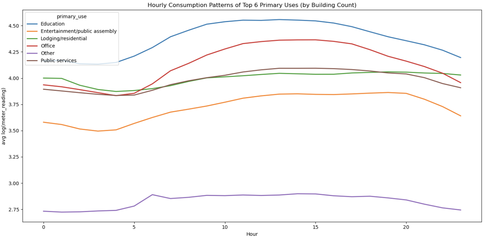
    
2. 평일/주말 비율
    
    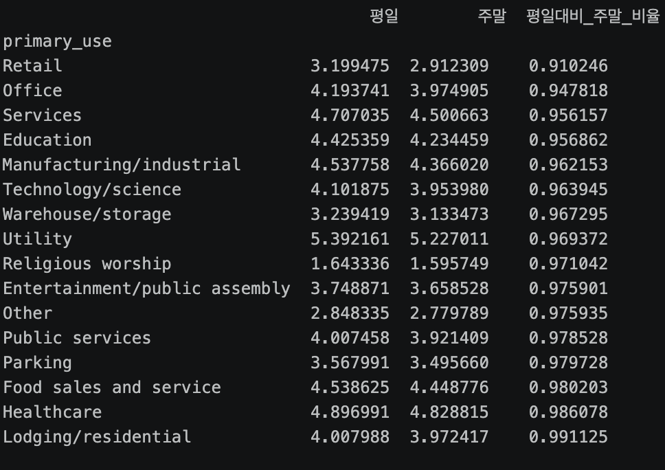
    
- 업무형 vs 상시형
    - 주말에 확 줄어드는 업무형 : Retail(0.91), Office(0.95), Services(0.96), Education(0.96)
        - 사람이 없으면 에너지도 확실히 줄어드는 패턴
    - 요일 상관없이 일정한 상시형 : Healthcare(0.986), Lodging/residential(0.991)
        - 병원, 숙박시설은 주말에도 거의 그대로 운영된다는 것이 숫자로 나옴.
- is_weekday_dependent
    - 업무형이 주말에 에너지 소비량이 더 많이 줄어든다.
        - 평일 4.339 → 주말 3.851로 상시형보다 더 큰 폭 감소
        
        |  | 평일 | 주말 |
        | --- | --- | --- |
        | 상시형 (0) | 3.923 | 3.851 |
        | 업무형 (1) | 4.339 | 4.138 |
1. 날씨 영향 (meter별 correlation)
    - 전기: -0.004 (거의 무관)
    - 냉수: +0.436 (냉방, 온도↑ → 소비↑)
    - 증기/온수: -0.41 내외 (난방, 온도↑ → 소비↓)

1. 구조적 발견
    - Site별 소비 패턴이 크게 다름
    - Building size 영향이 큼
        - 건물당 평균으로 정규화
        - site 13/14가 압도적으로 높음 → 대형 / 고소비 시설이 몰려있다.
        
        | site | 총 소비 | 건물 수 | 건물당 평균(대략) |
        | --- | --- | --- | --- |
        | 13 | 34.1억 | 154 | 약 2,215만 |
        | 14 | 16.5억 | 102 | 약 1,618만 |
        | 9 | 7.0억 | 124 | 약 568만 |
        | 0 | 5.9억 | 105 | 약 564만 |
        | 15 | 5.5억 | 124 | 약 441만 |
        
        → site 13/14에 대형/고소비 시설이 집중
        

---

## 10. 비즈니스 제안

1.  단기 수요 예측 (다음 1시간 에너지 사용량)

- RMSE : 1297
    - 예측값 vs 실제값 평균 오차 크기
    - 단위 = **전력 사용량 단위 (kWh 등)**
    - 평균적으로 약 **1300 정도 틀림**
        
        
        
        
        
- 시간대별 오차
    - 7~9시 = 출근 / 가동 시작
        - 패턴이 갑자기 변함, 오차 큼
    - 새벽
        - 오차 적음
    - 피크 구간
        - 사용량 자체가 큼 → 오차도 커짐
        - 비선형 패턴
            - 갑자기 켜지는 장비 → 모델이 못 맞춤

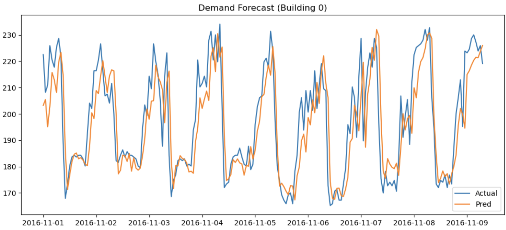

1.  이상 탐지: 비정상적인 에너지 사용 감지
    - 상위 1%를 이상치로 정의
    - meter별 이상치
        - meter 2가 압도적으로 많음
        - 증기 사용량에서 이상 패턴이 가장 많이 발생하였고, 이는 산업 설비 특성상 변동성이 크기 때문으로 예상됨
        
        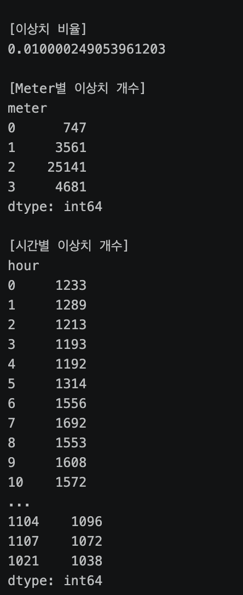
        
    - sample building_id 이상치
        
        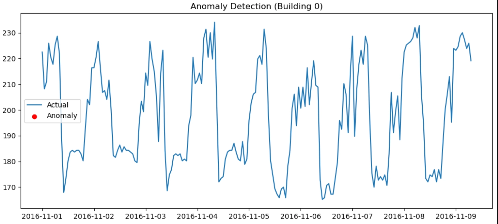
        
    - 시간대별 이상치 비율
        
        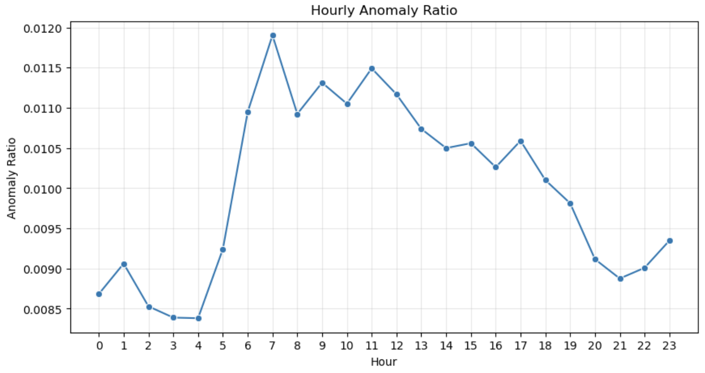
        
    - 이상 사례 분석
        - meter 2, hour 7, building_id 7
        - 7시 급등 이후 다시 정상 범위 → 일시적 이벤트성 이상
            
            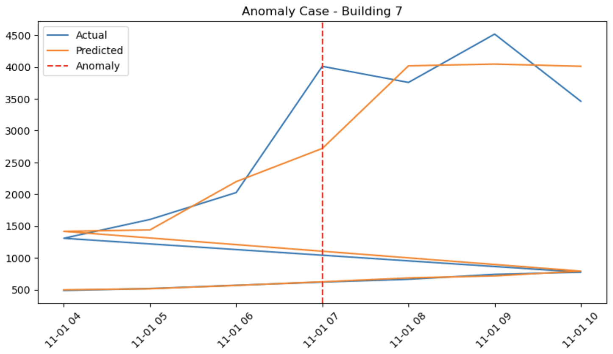
            
        - 비즈니스 해석
            - 운영 관점 : 업무 시작 시점에 설비가 동시에 가동되며 급격한 에너지 피크 발생
            - 문제점 : 현재 시스템은 이러한 급격한 수요 변화를 사전에 예측하지 못함
            - 해결 방향 : 피크 시간대 분산 제어 또는 사전 가동 전략 필요

1.  비즈니스 제안
    
    1. 에너지 이상 탐지 시스템 구축
    
    - 모델 예측 vs 실제 차이를 활용해서 실시간 이상 탐지 시스템 구축한다
        - 전기/냉난방 낭비 감지
        - 설비 이상 조기 발견
        - 유지보수 비용 절감
        
        ⇒ 예측 기반 이상 탐지를 통해 비정상 에너지 사용을 자동 감지하는 시스템 구축 가능
        
    1. **피크 시간대 관리 전략 ( ⇒ 11. 최적화 제안 방안 )**
        - 7~10시 오차 + 이상 집중
            - 설비 순차 가동 (staggering)
            - 피크 시간 요금 최적화
            - 자동 제어 시스템 도입
            
            ⇒ 업무 시작 시간대의 급격한 수요 증가를 완화하기 위한 피크 관리 전략 
            
    2. 특정 meter (증기) 집중 관리
        - meter 2 이상치 압도적
            - 증기 사용 설비 점검
            - 온도 기반 자동 제어
            - 누수/비효율 감지
            
            ⇒ 증기 사용 설비에서 비정상 패턴이 집중되어 효율 개선 및 설비 점검 필요
            
            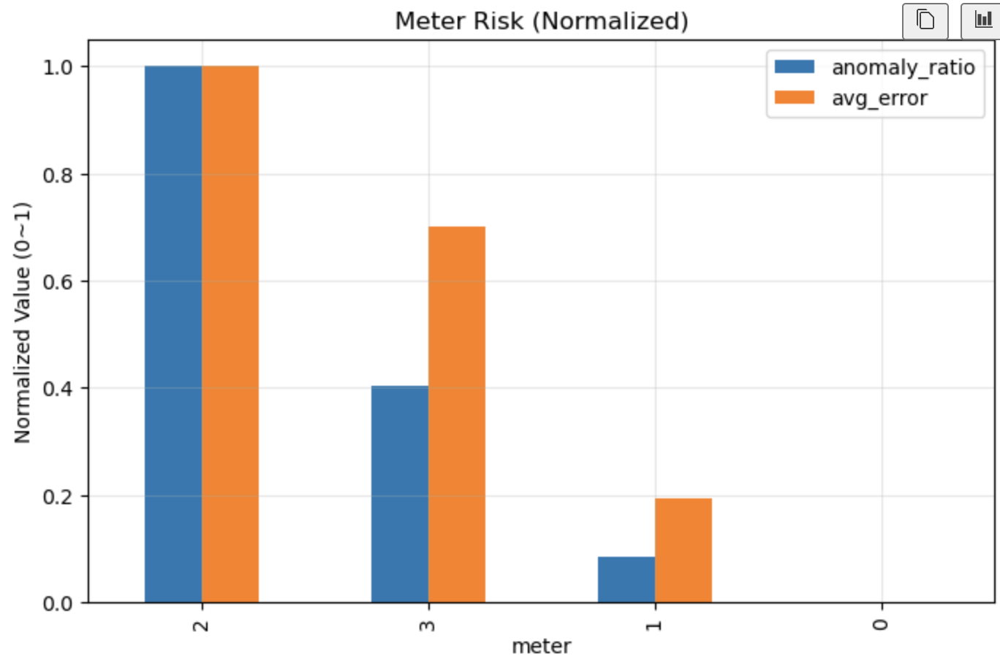
            
    3. 건물별 리스크 관리
        - building_id에서 이상 집중
            - 고위험 건물 리스트화
            - 관리 우선순위 설정
            - 맞춤형 운영 전략
            
            ⇒ 이상 발생이 많은 건물을 중심으로 타겟형 에너지 관리 전략 수립 가능
            
            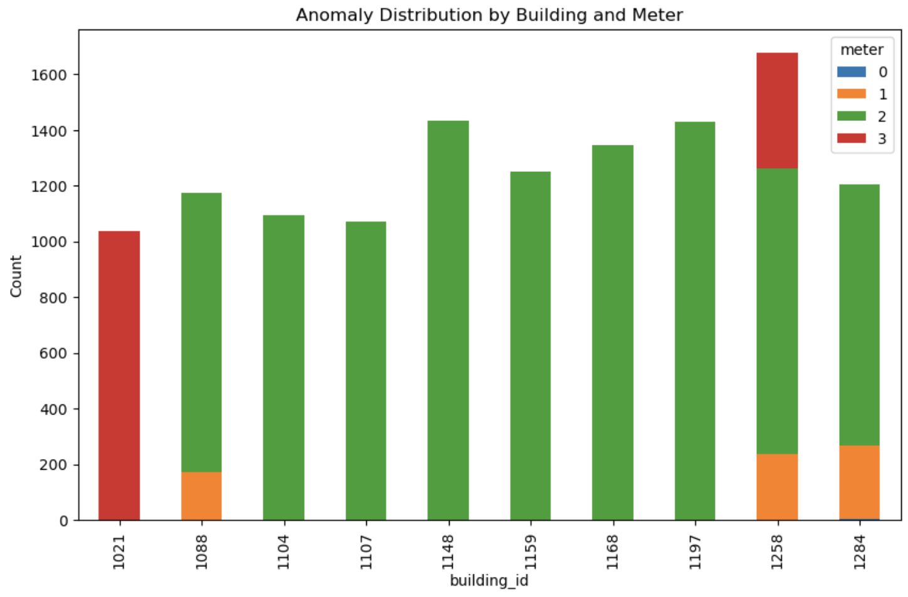
            
    4. AI 기반 스마트 빌딩 시스템
        - 현재 모델 → 서비스화
            - 실시간 예측
            - 이상 알림
            - 자동 제어 (HVAC 등)
            
            ⇒ AI 기반 에너지 관리 시스템으로 확장 가능
            

---

## 11. 최적화 제안 방안

앞선 예측 모델과 이상탐지 결과를 실제 운영 개선으로 연결하기 위해, LP(선형계획법) 기반 피크 저감 최적화 프로토타입을 구현했다. 예측 모델이 “무엇을 최적화할지”의 입력 데이터를 제공하고, 이상탐지가 “어디를 최적화할지”의 문제를 정의하며, meter별 오차 분석이 “결과를 얼마나 신뢰할지”의 기준을 제공한다 — 세 가지가 합쳐져 최적화 문제의 입력값·목적함수·제약조건을 구체적으로 규정한다.

| 앞선 분석 결과 | 최적화에서의 역할 |
| --- | --- |
| LightGBM 예측 모델 (RMSLE 0.4121) | 최적화의 입력 데이터. 시간별 예측치가 없으면 최적화할 대상 자체가 없음 |
| Building 7, meter=2, hour=7 이상 사례 | 최적화가 풀어야 할 구체적 문제 정의 (“이 건물의 이 시점 급등을 어떻게 분산시킬 것인가”) |
| meter별 RMSLE 차이 (전기 0.15 vs 증기 0.62) | 최적화의 신뢰 구간 설정. 예측 오차가 큰 트랙일수록 안전마진을 크게 설정 |
| 피크 시간대(7~9시) 오차가 유독 큼 | “예측 신뢰도가 낮은 구간에서는 보수적으로 최적화한다”는 설계 원칙의 근거 |
| lag_1 압도적 중요도 + ablation 실험 | 최적화를 실시간으로 돌릴 수 있는 조건(직전 1시간 데이터 필요)을 알려줌 |
| meter별 온도 상관관계 (전기 -0.004, 냉수 +0.436, 증기/온수 -0.41) | 증기 트랙의 물리 모델링(열관성 반영) 근거 |

최적화 프로토타입 설계 흐름

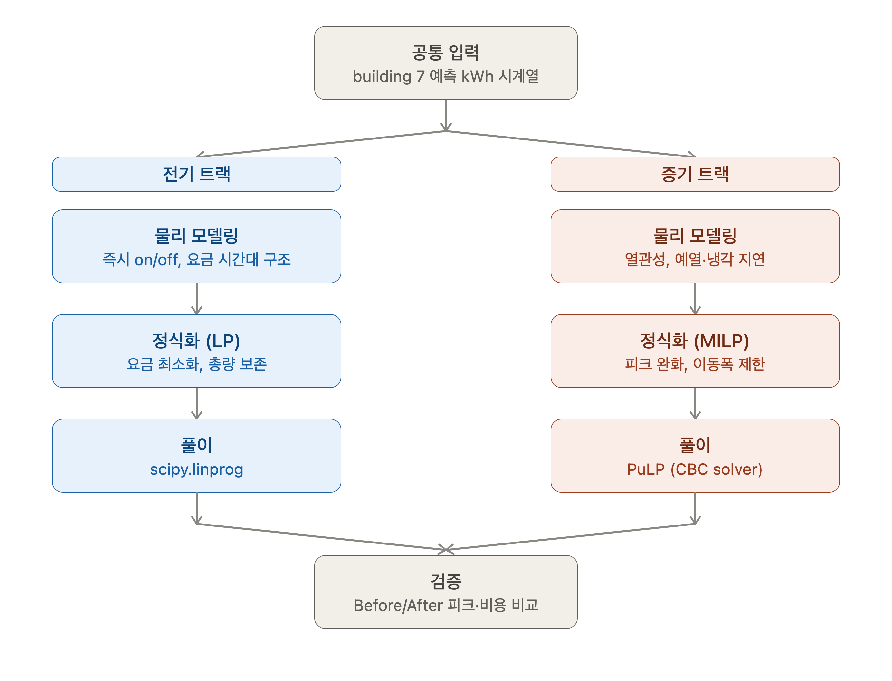

1. 물리 모델링 
    1. 전기 트랙
        
        전기는 저장이 안 되고 즉시 소비되지만, “언제 쓰느냐”는 자유롭게 조절할 수 있다. 모델링의 핵심은 시간축 위에서 부하를 옮기는 것이며, 물리 제약보다는 **요금 체계**가 지배 변수다.
        
        - 산업용 전기요금은 보통 3단계 시간대(경부하/중간부하/최대부하)로 나뉘고, 계절별로도 단가가 다름
        - 계약전력(최대수요전력, kW) 초과 시 페널티가 붙는 구조 → “총 사용량”이 아니라 “순간 최대치”를 낮추는 것 자체가 비용 절감으로 이어짐
        - 단순 kWh 비용 최소화가 아니라 **수요요금까지 포함한 최적화**가 필요
    2. 증기 트랙
        
        증기는 열 관성이 있다. 보일러를 켜면 목표 압력/온도까지 도달하는 데 시간이 걸리고, 끄면 바로 식지 않는다.
        
        - “1시간 뒤로 미루기”가 전기처럼 자유롭지 않음 → **예열시간(warm-up lag)**을 반드시 반영해야 함
        - 이상탐지에서 확인된 Building 7의 “7시 급등 → 정상 복귀”라는 이벤트성 피크는, 설비를 동시에 켜지 않고 **순차 기동(staggering)**시키는 문제로 재정의해야 함

1. Building 선정 기준
    
    ① 전기 트랙 — Building 802 (Education, site 7)
    
    - meter=0(전기) 전체 건물을 대상으로 가중합 스코어링
        - (평일·주말 격차 40% + peak_to_mean 35% + completeness 25%)을 적용해 선정
    
    | 기준 | 이유 |
    | --- | --- |
    | completeness > 0.9 | 예측 신뢰도 확보 |
    | weekday_weekend_gap > 15% | 업무시간 의존 패턴이 뚜렷한 건물만 선별 |
    | peak_to_mean(p95/mean) > 1.3 | 이동 가능한 뾰족한 피크가 있는 건물만 선별 |
    | site 13, site 0 제외 | steam에서 확인된 노이즈 사이트 / 전기 단위 미보정 이슈 회피 |
    
    ② 증기 트랙 — Building 802 (Education, site 7, steam)
    
    - 1차 스크리닝 : 정량 지표 기반 ( steam(meter=2) 전체 323개 building을 대상으로 다음 지표를 계산)
        - **completeness**: 관측 시간 수 / 전체 관측 가능 시간 수 (데이터 결측이 적을수록 예측 신뢰도 높음)
        - **temp_corr**: predicted_kwh와 외기온도의 상관관계 (음의 상관관계가 뚜렷할수록 열관성 기반 난방 패턴이 실제로 존재한다는 근거)
        - **peak_to_mean**: 시간별 predicted_kwh의 p95/mean 비율 (on/off 급등 패턴 강도)
        
        필터 조건(completeness > 0.9, temp_corr < -0.2, peak_to_mean > 1.3, 최소 관측기간 등)을 적용해 후보군을 추림.
        
    - 스크리닝 과정에서 발견한 두 가지 함정
        1. **저용량 건물의 비율 왜곡**: 
            1. 일부 건물(예: building 762)은 mean_predicted_kwh가 극도로 작아(2.4kWh) peak_to_mean 비율이 비정상적으로 크게 계산됨(10.54배). 
            2. 분모가 0에 가까워 생기는 통계적 착시이며, 실제 절감 효과의 절대량도 미미해 최적화 사례로 부적합. → 최소 절대 사용량 필터 추가로 제외.
        2. **특정 site 쏠림 현상**: 
            1. 상위 후보 15개 중 9개가 site_id=13에 집중됨. peak_to_mean 지표가 진짜 물리적 급등이 아니라 이 노이즈를 잡아낸 것일 가능성이 제기됨. → site 13을 배제하고 재검토.
    - 최종 검증 : 겨울철 diurnal 패턴 확인
        - site 13을 뺀 site 7 후보(798, 799, 797, 802) 4개에 대해 혹한기(외기온 0℃ 미만)로 필터링한 뒤 시간대별 평균·변동계수(CV)를 비교:
        
        | building | baseline | peak(시간) | peak/baseline | CV |
        | --- | --- | --- | --- | --- |
        | 798 | ~1450 | 3461 (8시) | 2.39 | 0.62 |
        | 799 | ~2520 | 4378 (7시) | 1.74 | 0.50 |
        | 797 | ~2450 | 2629 (8시) | 1.23 | 0.32 |
        | **802** | ~1750 | 3333 (8시) | **1.95** | **0.32** |
        
        ⇒ **Building 802**를 최종 선정 — 변동계수가 가장 낮아(패턴이 안정적) 신뢰도가 높으면서, peak/baseline 비율도 1.95배로 뚜렷한 급등 패턴을 보임. 새벽 baseline(1700~1750) → 6~8시 사이 완만한 상승 → 8시 peak(3333) → 저녁까지 서서히 baseline 복귀라는, 전형적인 보일러 예열-가동-냉각 곡선을 확인함.
        
    
    > 두 트랙 모두 building 802(Education, site 7)로 귀결된 점은, 이번 최적화 사례가 Education 편향 스크리닝의 결과라는 한계이기도 하다 — 다른 primary_use 건물로 일반화하려면 재검증이 필요하다.
    > 

1. 수학적 정식화
    1. **전기 (선형계획법, LP)** - v1→v4로 반복 개선
        
        
        | 버전 | 핵심 아이디어 | 발견된 한계 |
        | --- | --- | --- |
        | v1 | 에너지요금만 최소화, ±15% 재배치 제약 | 수요요금·계약전력 초과 페널티 미반영 |
        | v2 | P(peak) 변수 + 수요요금/초과페널티 추가 | excess가 158.0→70.3으로 줄었으나 0이 되지 않음 |
        | v3 | 고정부하(60%)/유연부하(40%) 물리적 분리 | 계약전력 제약 누락으로 peak가 원본보다 커지는 오류 발견 → 정정 |
        | **v4 (최종)** | ramp 하드 제약 + smoothness penalty(총변동 선형화) 추가 | 아래 결과 참고 |
    
    최종 정식화 (ramp_limit = 계약전력의 20%, smoothness_weight = 8.0):
    
    ```python
    변수: [flexible_0..23, P, excess, diff_0..23]  (50개)
    
    목적함수:
      Minimize  Σ price_t·flexible_t + demand_rate·P + overage_penalty_rate·excess
                + smoothness_weight·Σ diff_t
    
    제약:
      Σ flexible_t = flexible_pool_total          (유연부하 풀 총량 보존)
      fixed_t + flexible_t ≤ P                     (P = 최대부하)
      P − excess ≤ contract_power                  (계약전력 초과분 정의)
      |load_t − load_(t−1)| ≤ ramp_limit           (ramp 하드 제약, wrap-around 포함)
      diff_t ≥ |load_t − load_(t−1)|                (smoothness 선형화)
    ```
    

b.  **증기 (선형계획법, LP)** - 당초 설비 단위 on/off 가정한 MILP로 설계했으나,  실제 확보한 데이터가 건물 전체 합산 계량값뿐이라 설비별 기동 시점을 추정할 근거가 없어 **연속 변수 기반 LP**로 스코프를 재조정했다.

```python
목적함수: Minimize peak_load
변수: load_t (t=0~23, 조정된 시간별 부하)

제약:
  Σ load_t = Σ predicted_t                                  (총 사용량 보존)
  load_t ≥ baseline_min                                      (최소 운영량)
  |load_t − load_(t−1)| ≤ ramp_limit                          (시간당 변화폭 제약)
  predicted_t×(1−δ) ≤ load_t ≤ predicted_t×(1+δ)              (시간대별 이탈 한도, δ=예열 유연성 비율)
```

> 첫 시도에서 ramp 제약만 적용했을 때 결과가 하루 종일 완전히 평탄한 값으로 나왔는데, 이는 “각 시간대 실제 필요 열량과 너무 동떨어지면 안 된다”는 물리적 제약이 빠져 생긴 비현실적인 해였다. 전기와 달리 증기는 그 시간에 실제 필요한 난방 열량이 있어 총량을 무한정 재분배할 수 없다는 한계를 반영해 이탈 한도(δ) 제약을 추가했다.
> 

1. 풀이 및 검증
    1. 전기 : `scipy.optimize.linprog` — 24개 변수, 몇 개 제약식, 밀리초 단위로 풀림
    2. 증기: 연속 변수 LP로 재정의되어 역시 `scipy.optimize.linprog`로 충분
    
    **① 전기 트랙 결과 — Building 802 · 여름철 · 고정부하 60% · 유연부하 풀 4,522.2 kWh/일**
    
    | 항목 | Before | After |
    | --- | --- | --- |
    | 에너지요금 | 1,876,319 | 1,700,213 |
    | 수요요금 | 193,579 | 149,877 |
    | 초과페널티 | 131,105 | 0 |
    | **총비용** | **2,201,002** | **1,850,090** |
    - **총 절감액: 350,912원 (15.94%)**
    - 최대부하(peak): 699.7 → 541.7 kWh (계약전력 이하로 완전 수렴)
    - 계약전력 초과분(excess): 158.0 → **0.0 kWh**
    
    전기 트랙 최적화 결과 - Building 802
    
    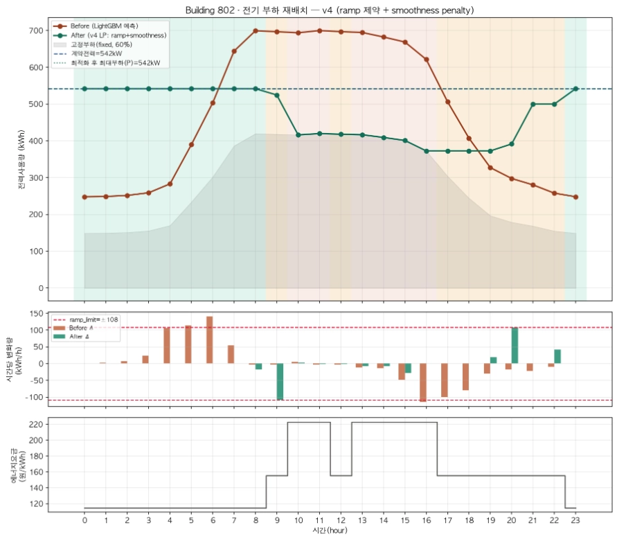
    
    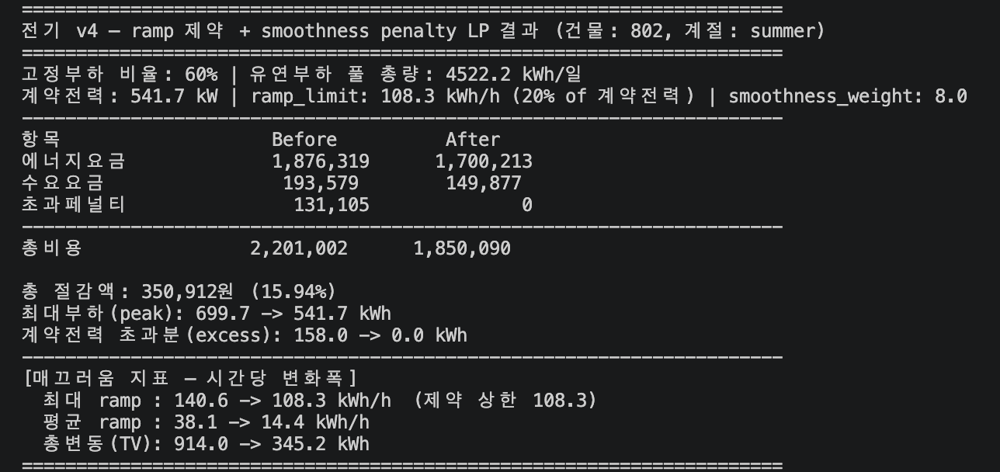
    
    민감도 분석 (파라미터 근거)
    
    - `ramp_limit_pct`(20%)와 `smoothness_weight`(8.0)는 절감 효과와 매끄러움 사이의 트레이드오프 파라미터. 두 값 모두 임의 설정값이므로, 다음을 스윕해 근거를 보강할 것을 제안:
        - `ramp_limit_pct`: 10~30% 구간에서 절감율/최대ramp 변화 확인
        - `smoothness_weight`: 0(끔)~20 구간에서 절감율/TV 변화 확인, "몇 원부터 매끄러움이 절감율을 갉아먹기 시작하는지" 임계점 도출
    
    **② 증기 트랙 결과 — Building 802 (Education/site 7/steam/winter), δ=15% 기준**
    
    | 지표 | Before | After |
    | --- | --- | --- |
    | Peak load | 3,333.4 kWh (8시) | 2,833.4 kWh |
    | **Peak 완화율** | – | **15.0%** |
    
    증기 트랙 Peak Shaving 결과 - Building 802
    
    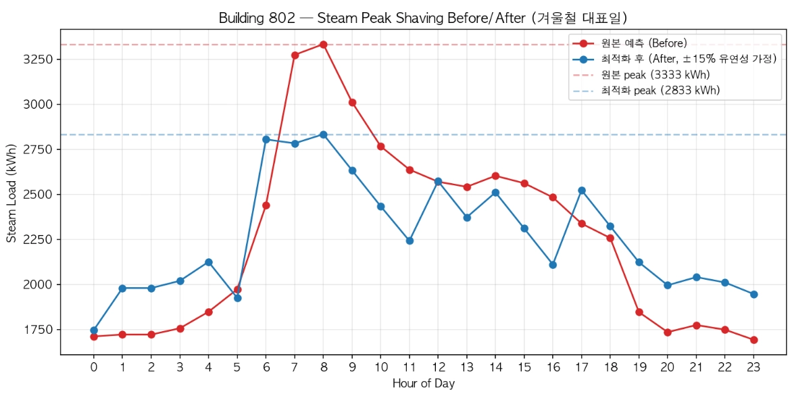
    
    민감도 분석 
    
    - peak 완화율은 δ 값과 정확히 1:1 선형 관계(δ=5%→완화 5%, δ=30%→완화 30%)임을 확인
    - ramp-rate 제약이 이 문제 규모에서는 구속력이 없고, 결과가 전적으로 “건물이 시간당 예상 수요 대비 얼마나 유연하게 열량을 앞뒤로 당길 수 있는가”라는 가정(δ)에 의해 결정됨을 의미
2. 한계 및 제안
    - `ramp_limit`, `smoothness_weight`, `δ` 모두 실측 설비 데이터가 아닌 가정치 — 대표값으로 제시했음을 명확히 할 필요가 있음
    - 대표 하루(weekday 평균) 기반 최적화이므로, wrap-around 가정(23시→0시 연속)이 실제 매일 반복 운영과 얼마나 맞는지는 별도 검증 필요
    - site 13은 steam 계량 데이터 신뢰성 문제로 이번 분석에서 배제 — 다른 사이트로 프레임워크를 확장할 때도 사이트별 데이터 품질을 먼저 검증해야 함
    - 두 트랙 모두 Building 802(Education)로 귀결된 것은 Education 편향 스크리닝의 결과 — 다른 primary_use 건물로 일반화하려면 추가 검증 필요
    
    ⇒ 이번 최적화는 “비즈니스 제안 2번: 피크 시간대 관리 전략”의 **기술적 증명(proof of concept)**이다 — 제안에서 끝나지 않고, 실제 수치(전기 15.94%, 증기 15.0% 절감/완화)로 실현 가능성을 확인했다.
    

---

## 12. 한계 및 향후 개선

- **신규 건물/장기 예측 취약성**: lag 기반 관성 정보가 핵심 근거이기 때문에, 과거 이력이 없는 신규 건물이나 먼 미래 시점 예측에는 성능이 크게 저하됨 → 유사 건물 클러스터링을 통한 대체 평균(`building_mean`) 산출 방안 필요
- **온수(hotwater) 예측 정확도 개선**: on/off 패턴으로 인해 RMSLE가 가장 높음 → 이진 사용 여부(가동/미가동) 분류 모델을 별도로 결합하는 2단계 접근 검토
- **피크 시간대(7~10시) 오차 감소**: 급격한 수요 변화를 사전에 반영하지 못함 → 사전 가동 스케줄, 순차 기동 패턴을 feature로 반영
- **소수 건물/meter 조합의 국소적 오차**: 전체 지표는 양호하나 특정 Office/Entertainment 건물의 온수 계량기에서 오차가 집중 → 건물별 개별 보정 모델 또는 잔차 기반 후처리 도입
- **최적화 파라미터의 가정치 의존**: `ramp_limit`, `smoothness_weight`, `δ`가 실측 설비 데이터가 아닌 가정치 → 실제 설비 스펙(보일러 예열시간, 배전 용량 등) 확보 시 재보정 필요
- **최적화 사례의 Education 편향**: 전기·증기 트랙 모두 Building 802(Education, site 7)로 귀결 → Office, Healthcare 등 다른 용도 건물로 프레임워크 일반화 시 재검증 필요
- **Ensemble 모델 확장**: XGBoost, CatBoost와의 앙상블을 통한 추가 성능 개선 여지
